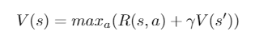
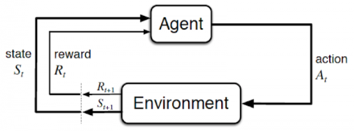
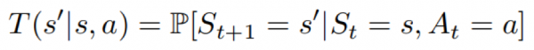
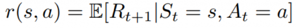

# Week 01 Notes - Markov Decision Processes

<!-- MarkdownTOC -->

1. [Introduction \(Move 37\)](#introduction-move-37)
1. [The Bellman Equation](#the-bellman-equation)
1. [Markov Decision Processes](#markov-decision-processes)
1. [Value Functions Quiz](#value-functions-quiz)
1. [Homework Assignment - OpenAI Gym Installation](#homework-assignment-openai-gym-installation)
1. [Sensor Networks](#sensor-networks)
1. [Google Dopamine](#google-dopamine)
1. [Reading Assignment \(Policy Functions\)](#reading-assignment-policy-functions)

<!-- /MarkdownTOC -->

### Introduction (Move 37)
Welcome to my new reinforcement learning course titled Move 37! in this 10 week course we'll go over the basics of reinforcement learning up to modern day techniques that involve neural networks called 'deep' reinforcement learning. In this first video, I'll introduce the idea of a Markov Decision Process. This is the basic mathematical framework for framing the reinforcement learning problem. We'll also briefly mention the ideas of a 'policy' and the agent-environment loop. Get hype!

**Take Aways**:
- In Reinforcement Learning, an AI learns how to optimally interact in a real-time environment using time-delayed labels, called rewards as signal
- The Markov Decision Process is a Mathematical Framework for defining the Reinforcement Learning Problem using States, Actions and Rewards
- Through interacting with the environment, an AI will learn a Policy which will return an Action for a given State with the highest Reward

**Learning Resources**:
- [Youtube Video](https://www.youtube.com/watch?time_continue=615&v=fRmZck1Dakc)
- [Code Link](https://github.com/llSourcell/Introduction_Move37)
- [Reinforcement Learning Demystified Part 1](https://towardsdatascience.com/reinforcement-learning-demystified-markov-decision-processes-part-1-bf00dda41690)
- [Lecture: Markov Decision Processes](http://www0.cs.ucl.ac.uk/staff/d.silver/web/Teaching_files/MDP.pdf)
- [An Introduction to Markov Decision Processes](https://www.cs.rice.edu/~vardi/dag01/givan1.pdf)
- [Markov Decision Processes](https://ocw.mit.edu/courses/electrical-engineering-and-computer-science/6-825-techniques-in-artificial-intelligence-sma-5504-fall-2002/lecture-notes/Lecture20FinalPart1.pdf)
- [Art Int - Decision Processes](https://artint.info/html/ArtInt_224.html)

### The Bellman Equation
[Youtube Video](https://www.youtube.com/watch?time_continue=68&v=JMpslE8GtCo)

**Important Bellman Concepts**
- STATE: a numeric representation of what the agent is observing at a particular point of time in the environment
- ACTION: the input the agent provides to the environment, calculated by applying a policy to the current state
- REWARD: a feedback signal from the environment reflecting how well the agent is performing the goals of the game

**Goal of Reinforcement Learning**  
Given the current state we are in, choose the optimal action which will maximize the long-term expected reward provided by the environment.

**Dynamic Programming**  
A class of algorithms which seek to simplify complex problems by breaking them up into sub-problems and solving the sub-problems recursively (by a function that calls itself)

**What Question Does the Bellman Equation Answer?** 
- Given the state I'm in, assuming I take the best possible action now and at each subsequent step, what long-term reward can I expect?
- What is the VALUE of the STATE?
- When our AI is deciding on an optimal policy, we want it to make decisions based on the best it can do given the state it's in
- It helps us evaluate the expected reward relative to the advantage or disadvantage of each state

**Bellman Equation**  

_Gamma Tips_
- Important to tune this hyper-parameter to get optimum results
- Successful values range between 0.9 and 0.99
- Lower value encourages short-term thinking
- Higher value emphasizes long-term rewards

### Markov Decision Processes
Reinforcement learning problems are mathematically described using a framework called Markov Decision Processes (MDPs). These are the extended version of [Markov Chains](https://en.wikipedia.org/wiki/Markov_chain) which adds decisions and rewards elements to it.

_Key Terms:_
- **State**: A set of tokens that represent every condition that the agent can be in.
- **Model**: Sometimes called Transition Model gives an action's effect in a state. In particular, T(S, a, S’) defines a transition T where being in state S and taking an action ‘a’ takes us to state S’ (S and S’ may be same). For stochastic actions (noisy, non-deterministic) we also define a probability P(S’|S,a) which represents the probability of reaching a state S’ if action ‘a’ is taken in state S.
- **Actions**: Set of all possible decisions. a(s) defines the set of actions that can be taken being in state S.
- **Reward**: A real-valued response to an action. R(s) indicates the reward for simply being in the state S. R(S, a) indicates the reward for being in a state S and taking an action 'a'. R(S, a, S') indicates the reward for being in a state S, taking an action 'a' and ending up in a state S'.
- **Policy**: A solution to the Markov Decision Process. It is a set of actions that are taken by the agent to reach a goal. It indicates the action ‘a’ to be taken while in state S. A policy is denoted as ‘Pi’ **π(s) ->** ∞.
- **π*** is called the **optimal policy**, which maximizes the expected reward. Among all the policies taken, the optimal policy is the one that optimizes to maximize the amount of reward received or expected to receive over a lifetime.

**Markov Decision Process (MDP) is a tuple(S,A,T,r,?)**:

- S: Set of observations. The agent observes the environment as one item of this set.
- A: Set of actions. The set of actions the agent can choose one from to interact with the environment.
- T: P(s'|s,a) transition probability matrix. This models what next state s' will be after the agent makes the action _a_ while being in the current state _s_.  

- r: P(r|s,a) reward model that models what reward the agent will receive when it performs an action _a_ when it is in state _s_.  

- **?**: discount favor. This factor is a numerical value between 0 and 1 that represents the relative importance between immediate and future rewards. I.e, If the agent has to select between two actions one of them will give it a high immediate reward immediately after performing the action but will lead into going to state from which the agents expect to get less future rewards than another state that can be reached after doing an action with less immediate reward?

### Value Functions Quiz

1. What is a Value function?
    - The value function in reinforcement learning estimates "how good" a state is for an agent to be in.
    - Value function may also be referred to as ‘Value of Policy’
    - Value function is a method that gives a reward excluding discount factor.
2. What are the types of Value functions?
    - State-Value function: This is the expected/discounted reward when starting in state ‘s’ and successively following a policy ‘π’ for an action. It us usually denoted as V(s) or Vπ(s). State-Value function tries to find “How good is a state” for an agent in the environment.
    - Action Value function: This focuses on the particular action ‘a’ at the particular state ‘s’ and returns a real value. It is also referred to as Q-function. This state-action pair Q-function is usually denoted as Q(s, a). Action-Value function tries to find “How good is a state action pair” for the agent in the environment
3. What is Optimal Value function?
    - Optimal Value function is value of a state for an optimal policy, π*, which maximizes the discounted reward. Kindly note that among all possible value-functions, there exist an optimal value function that has higher value than any other functions for all states (i.e. the max value). It is usually denoted by V*(s)
4. What is the relationship between optimal value function V*(s) and value of policy Vπ(s)?
    - Since optimal value function V*(s) is the highest (or max) of the value functions for all given policies, relationship between V*(s) and Vπ(s) may be defined as V*(s)
5. What are Markov Decision Processes (MDPs)?
    - Markov Decision Processes (MDPs) is a framework only
    - MDPs aim at mathematically describing reinforcement learning problems
    - With MDPs, it is reasonable to assume that the current state encapsulates all that is needed to decide the future state when an input action is received from the current state
    - **Explanation**: Markov Decision Processes (MDPs) is a framework that aims at mathematically describing reinforcement learning problems. Markov in MDPs represents Markovian property which states that future state is independent from any previous states’ history given the current state and action. In other words, it is reasonable to assume that the current state encapsulates all that is needed to decide the future state when an input action is received from the current state. MDPs extend Markov Chain by adding decisions and reward elements. This simplifies solving many problems. The goal of an agent during a reinforcement learning is, fundamentally, to solve the MDP by finding the optimal policy that defines the sequence of actions the agent can make to maximize the total discounted reward received from the environment.
6. What is '?' in MDPs 5 tuple?
    - This is a numerical value between 0 and 1
    - **Explanation**: ? : Discount factor for rewards. This factor is a numerical value between 0 and 1. The larger the factor, the smaller the discount. Some may perceive this to mean that the learning agent cares more about the long term reward. The smaller the factor, the bigger the discount. Some may perceive this to mean that the agent cares more about the short term reward. Discount factor has little to do with proximity of high and low reward regions but everything to do with prioritization of closer (in time) rewards. In other words, discount factor works as an ‘urgency of life in real world’  where some humans live as if the world is going to come to an end while some are relaxed. In addition, discount factor is meant to help with computational resources’ numerical limitations. If rewards grow exponentially and are not bounded, then their discounted sum (or value function) does not converge. Computers in general cannot handle arbitrarily big numbers.

### Homework Assignment - OpenAI Gym Installation
Look at hw01/ directory.

### Sensor Networks
What is the best way to route data in a network of routers spread out across the globe? This 'Internet of things'-based problem can be solved using reinforcement learning! In this video, I'll explain the 2 types of policies, the bellman equation, and the value function. All of these concepts are crucial in the RL pipeline and using animations + code, I'll break them down. Enjoy!

**Take Aways**:
- There are two types of policies:
    + Deterministic where the action taken entirely depends on the state
    + Stochastic which allows for randomness
- To learn an optimal policy, we need to learn an optimal value function of which there are 2 kinds:
    + State-Action
    + Action-Value
- We can compute the value function using the Bellman Equation which expresses the Value of any State as the sum of the immediate Reward plus the Value of the State that follows

**Learning Resources:**
- [Youtube Video]()
- [Code Link](https://github.com/llSourcell/Sensor_Networks)
- [The very basics of Reinforcement Learning](https://becominghuman.ai/the-very-basics-of-reinforcement-learning-154f28a79071)
- [An introduction to Reinforcement Learning](https://medium.freecodecamp.org/an-introduction-to-reinforcement-learning-4339519de419)
- [Reinforcement Learning Explained](https://www.oreilly.com/ideas/reinforcement-learning-explained)
- [Reinforcement Learning Basics](http://kvfrans.com/reinforcement-learning-basics/)
- [Basics of Computation Reinforcement Learning](https://medium.com/syncedreview/basics-of-computational-reinforcement-learning-fca09f3609ea)
- [A Deep Dive into Reinforcement Learning](https://www.toptal.com/machine-learning/deep-dive-into-reinforcement-learning)
- [Learning Reinforcement Learning](http://www.wildml.com/2016/10/learning-reinforcement-learning/)

### Google Dopamine
Google recently released a research framework for fast prototyping of reinforcement learning algorithms called "Dopamine". They say that it aims to fill the need for a small, easily grokked codebase in which users can freely experiment with wild ideas (speculative research). In this live stream I'll test it out, try out a few basic reinforcement learning algorithms and compare it to similar frameworks. You can code along with me using CoLab. Get hype!

**Learning Resources**:
- [Youtube Video](https://www.youtube.com/watch?v=FWFoyFjeAaM)
- [Code Link](https://github.com/llSourcell/Google_Dopamine_LIVE)
- [Google Dopamine Github Repo](https://github.com/google/dopamine)
- [Google AI Blog - Introducing a New Framework for Flexible and Reproducible Reinforcement Learning Research](https://ai.googleblog.com/2018/08/introducing-new-framework-for-flexible.html)
- [Josh Greaves - Understanding RL: The Bellman Equations](https://joshgreaves.com/reinforcement-learning/understanding-rl-the-bellman-equations/)
- [Deepmind Reinforcement Learning Youtube Video](https://www.youtube.com/watch?v=N0Ld2iTMaMs)

### Reading Assignment (Policy Functions)
1. A Machine Learning journal by Luca Palmieri
    A well-organized blog that helps people who study for the first time understand RL. It is suitable for the first  reading assignment with short length and interesting pictures attached.

    - [Part 0](https://www.lpalmieri.com/posts/rl-introduction-00/#markov-decision-processes-mdps)  
    - [Part 1](https://www.lpalmieri.com/posts/rl-introduction-01/#policies)

2. Reinforcement Learning Demystified: Markov Decision Processes by Mohammad Ashraf
    This blog explained Richard Sutton’s book to make it easy to understand, and it is a good starting point for those who want to study deeply in the future, using well-known lecture notes from David Silver.

    - [Part 1](https://towardsdatascience.com/reinforcement-learning-demystified-markov-decision-processes-part-1-bf00dda41690)

3. UCL Course on Reinforcement Learning by David Silver (2015)
    The famous David Silver’s lecture on RL. Video and slide notes are quoted from most RL textbooks and lectures. Student MRP is already quoted in the blog above, and it’s a popular example of MDP that everyone sees once in their course of study.  

    - [Course Link](http://www0.cs.ucl.ac.uk/staff/d.silver/web/Teaching.html)
    - [Lecture 1: Introduction to Reinforcement Learning](http://www0.cs.ucl.ac.uk/staff/d.silver/web/Teaching_files/intro_RL.pdf)
    - [Lecture 2: Markov Decision Processes](http://www0.cs.ucl.ac.uk/staff/d.silver/web/Teaching_files/MDP.pdf)

4. (bonus) Reinforcement Learning: An Introduction by Richard S. Sutton and Andrew G. Barto (Second edition, 2018)
    A Bible written by RL’s father Richard Sutton. It’s a great masterpiece without a doubt, but it can be a bit difficult for people who start studying for the first time.
    - [RL Book (Pages 58-62)](https://drive.google.com/file/d/1xeUDVGWGUUv1-ccUMAZHJLej2C7aAFWY/view) 

