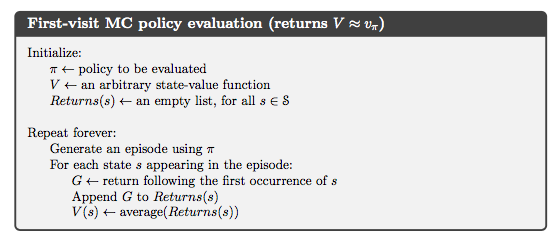
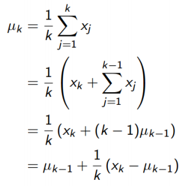
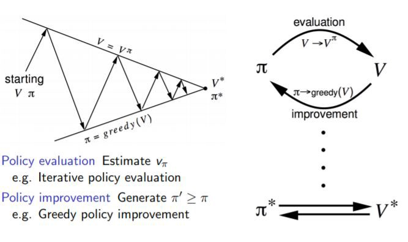
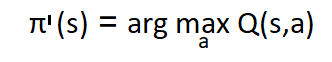
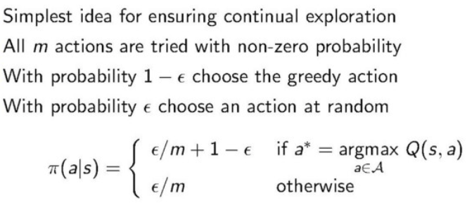
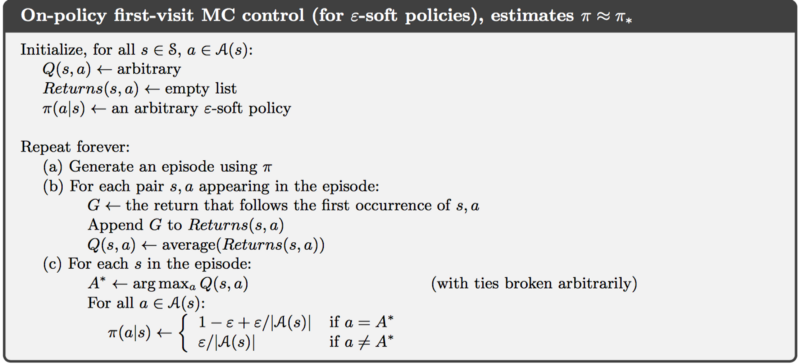

# Week 03 Notes - Monte Carlo Methods

### Internet of Things Optimization
The Internet of things lives! More and more devices are coming prepackaged with Internet access that wouldn’t normally be. That includes everything from smart salt shakers to smart tabletops. And because these devices have a connection to the world wide web, they can communicate with the outside world and each other, sharing information and even learning from one another. In this video, I'll explain how to use a reinforcement learning technique called "Monte Carlo" to optimize electricity consumption and cooling demands for a smart home. Enjoy!

**Notes**:

- Markov Decision Process is a fundamental way of framing the Reinforcement Learning problem where an agent is interacting with an environment to maximize a reward
- Agent's goal is to learn a policy so it knows given a state the best action to take in order to maximize a reward
- In a complete Markov Decision Process where all of the environment variables are known we can use dynamic programming to learn an optimal policy
- But what if we don't know all the environment variables? This would be considered a Model Free RL, not Model Based RL.
    + Model-Based Learning: Learn the model, solve for values
    + Model-Free Learning: Solve for values directly (by Sampling)
- In Model Free RL, the we miss the transition model and the reward function. So we don't know what's going to happen after each action we take beforehand and the agent won't get an award associated with a particular state beforehand.
- Dynamic Programming won't work when these 2 Markovian variables are not available
- We use Monte Carlo Method
    + Large family of computation algorithms that rely on repeated random sampling to obtain numerical results
    + They make use of randomness to solve problems
- Reasons for using Monte Carlo vs. Dynamic Programming
    + No need for a complete Markov Decision Process: Allow for learning optimal behavior directly from interaction with the environment without needing the transition or reward function defined beforehand
    + Computationally more efficient: Focus MC methods on a small subset of the total states
    + Can be used with Stochastic Simulations
- In Monte Carlo RL, we are estimating the value function for each state based on the return of each episode. The more episodes we take into account the more accurate our estimation will be.
    + Potential problem: What if we visit the same state twice in a single episode? 
    + There are two types of Monte Carlo policy evaluations:
        * First-Visit
        * Every-Visit
- First-Visit:
    +  Only recognizes the first visited state. Every second visit does not count the return for that state visit and the return is calculated separately for each visit.
- Monte Carlo includes randomness because when it updates every episode depending on where it originated from it's a different result depending on which action we take in the same state.
- Because it contains these random elements, Monte Carlo has a high variance   

**Take Aways**:

- In Model-Free Reinforcement Learning, as opposed to Model Based, we don't know the Reward Function and the Transition Function beforehand. We have to learn them through experience
- A Model-Free Learning Technique called Monte Carlo uses Repeated Random Sampling to obtain numerical results
- In First Visit Monte Carlo, the State Value Function is defined as the average of the returns following the agents first visit to S in a set of episodes

**Learning Resources**:

- [Youtube Video](https://www.youtube.com/watch?v=kYWw6GBRjVk)
- [Code Link](https://github.com/llSourcell/Internet_of_Things_Optimization)
- [Reinforcement Learning - Monte Carlo](https://www.kth.se/social/files/58b941d5f276542843812288/RL04-Monte-Carlo.pdf)
- [Reinforcement Learning & Monte Carlo Planning](https://courses.cs.washington.edu/courses/csep573/12au/lectures/18-rl.pdf)
- [Reinforcement Learning - Monte Carlo Methods](https://stat.ethz.ch/education/semesters/ss2016/seminar/files/slides/RL_MCM_heinzer_profumo.pdf)
- [Ch 12.1: Model Free Reinforcement Learning Algorithms](https://medium.com/deep-math-machine-learning-ai/ch-12-1-model-free-reinforcement-learning-algorithms-monte-carlo-sarsa-q-learning-65267cb8d1b4)
- [RL Lecture 5: Monte Carlo Methods](http://www-edlab.cs.umass.edu/cs689/lectures/RL%20Lecture%205.pdf)
- [Model-Free Prediction & Control with Monte Carlo](https://github.com/dennybritz/reinforcement-learning/tree/master/MC)

### Video Lesson (Exploration vs. Exploitation)
[Youtube Video](https://www.youtube.com/watch?time_continue=3&v=cEFx3wtNONE)

**Notes**:

- Fundamental concepts in Reinforcement Learning: Exploration vs. Exploitation
- Whenever an agent is faced with a series of options with unknown rewards and we are trying to maximize the reward the agent will receive, there is a need to balance exploring the options and repeating those which are shown to give rewards
- Example: Suppose you've gone to a restaurant once before and quite enjoy your meal. Looking at the menu, you will be tempted to get the same item you ordered last time, exploiting the knowledge you've previously acquired on which of the dishes is most tasty. On the other hand, you could take a more exploratory strategy by trying a new dish with the hope that this will be tastier than the last dish
- Example: Trick or treaters walking together on Halloween. Suppose that these kids want to maximize the amount of candy they can collect within the limited time span of Halloween night. One kid suggests try going to every house and see which gives the most candy. The other argues that they stick to a single block with a good payout returning continuously to the same houses.
- Which strategy is better? In generation, we get the most reward by finding a balance between exploring and exploiting.
- One way to modulate this behavior in an agent is to control the value of Epsilon, the chance of taking a random action:
    + Increase Epsilon: Epsilon Greedy - increasing our change of the agent taking a random action, we encourage our agent to explore for new rewards
    + Decrease Epsilon: Greedy - encourage our agent to exploit acquired knowledge of rewards taking the action with the highest estimated reward

### Reading Assignment (Exploration vs Exploitation and Multi-Armed Bandits)

**[Basic] Understanding concepts with math**

This article easily explains concepts of “exploration vs. exploitation trade-off” by examples like choosing a restaurant or food. It also suggests some strategies how they could play out in our lives and explains how to get money faster using multi-armed bandits, so be sure to read it and become rich.

- [Exploration vs. Exploitation](https://medium.com/@dennybritz/exploration-vs-exploitation-f46af4cf62fe)
- [Multi Arm Bandits and the Explore/Exploit trade-off](http://www.primarydigit.com/blog/multi-arm-bandits-explorationexploitation-trade-off)
- [Multi Armed Bandit Testing Can Make You More Money, Faster](https://www.searchenginepeople.com/blog/16072-multi-armed-bandits-ab-testing-makes-money.html)

**[Intermediate] Understanding deeper concepts using math**

If you understand the basic concepts, use math to study each of the strategies presented earlier. These are  well-organized lecture note useful for those who want to study deeper. If you’re not familiar with math, just skip over them without trying to understand them. Still, it is worth reading enough.

- [Deep Reinforcement Learning and Control](http://www.cs.cmu.edu/~rsalakhu/10703/Lecture_Exploration.pdf)
- [David Silver Lecture 9 - Exploration and Exploitation](http://www0.cs.ucl.ac.uk/staff/d.silver/web/Teaching_files/XX.pdf)
- [RL Course by David Silver - Lecture 9: Exploration and Exploitation](https://www.youtube.com/watch?v=sGuiWX07sKw)

**[More]**

MAB is such a popular example that you will see it more often than not. 

- [Wikipedia: Multi Armed Bandit](https://en.wikipedia.org/wiki/Multi-armed_bandit)
- [Casinopedia: One Armed Bandit](https://www.casinopedia.org/terms/o/one-armed-bandit)

### Monte Carlo Coding Tutorial
- [Youtube Video](https://www.youtube.com/watch?v=mMEFFN1H5Cg)
- [Code Link](https://github.com/colinskow/move37/tree/master/dynamic_programming)

**Dynamic Programming**:

- Brute force algorithm
- Requires looping through all possible states and actions
- Not practical for large state or action spaces

**Monte Carlo**:

- Only update value table, V for visited states
- Don't need to know states ahead of time
- Simply discover them as we play
- Therefore, much more efficient for creating optimal policy in more complex games
    + Monte Carlo algorithm is at the heart of Alpha Zero's success in learning extremely complex games like Chess and Go from scratch and playing them at a super human level
- Chess has pushed the limits of brute force computing and Go is so complex, brute force is impossible
- When it's impossible or impractical to try out each possibility we can either
    + Randomly sample moves
    + OR (ideally) intelligently sample what's most promising
- Real world games don't have 'God' mode
    + We knew all the details: state transition probabilities, and never actually played the game
    + Often, we don't know transition probabilities ahead of time
- Simply play the game and collect experience
- Use the familiar Bellman Equation to estimate returns from each state, given current policy
- Iterative improve both value calculations and policy with every episode
- Need to learn basic concepts of Q learning

**Q Learning**:

- Q = Quality
- Q = long-term discounted reward we expect from taking action a in state s

**What's Changed**:

- We are now dealing with estimates rather than perfect values
- We are learning from experience without knowing ahead of time what the best action is
- We are calculating the expected value relative to current policy
- Better value estimate = better policy estimate = better values

**Policy**:

- Policy is a simple lookup table: state -> best action
- Start with a random policy in Monte Carlo
- Play the game, use experience to improve value estimates
- Better value estimates improve policy

**Returns (G)**:

- Return: the reward from our immediate action, plus all discounted future rewards from applying the current policy
- Denoted by capital G
- $$G_t = r_(t+1) + \gamma {G_(t+1)}$$
- Work in reverse from final state applying this formula
- Once several (s, G) pairs are collected, average them to estimate the value of each state

**Algorithm to Calculate Returns**:

- Initialize G to 0
- states_and_returns = []
- Loop backwards through the list of state_and_rewards (s, r):
    + append (s, G) to states_and_returns
    + G = r + gamma * G
- reverse states_and_returns to the original order

**Explore/Exploit Dilemma**:

- We must strike a balance between explore/exploit
- We are going to use a strategy called 'epsilon greedy'
- Epsilon is the probability that our agent will choose a random action instead of following policy

**Epsilon Greedy Algorithm**:

- Generate a random number p, between 0 and 1
- if $$p < (1 - \epsilon)$$ take the action dictated by policy
- otherwise take a random action

**First Visit Optimization**:

- What happens if we visit the same state more than once?
- It's been proven subsequent visits won't change the answer
- All we need is the first visit to every given state
- We throw away the rest of the data - makes our computing faster

**Monte Carlo Q Learning Algorithm**:

1. Initialize a policy to a random action for every state
2. Initialize Q[(s, a)] to 0 for every possible state and action
3. Initialize returns[(s, a)] as an empty array for each possible state and action
4. Loop N times (enough for values to converge):
    5. play the game and get a list of states_actions_returns
    6. For (s, A, G) in states_actions_returns:
        7. If we haven't seen this (s, a) pair so far in the game
            8. append G to returns[s, a]
            9. Q[s][a] = mean(returns[s, a])
        10. For each non-terminal state s:
            11. policy[s] = the action with the highest Q value for state s
12. for each state s, V[s] = highest Q value for state s
13. Return V, policy

### MC Control & MC Prediction

There are 2 types of tasks in reinforcement learning:
- Prediction
- Control

**Prediction**:

- A task that can predict expected total reward from any given state assuming the function **π(a|s)** is given.
- It predicts the value function **Vπ**
- Example: Policy evaluation (Estimate)

**Control**:

- A task that can find policy **π(a|s)** that maximizes the expected total reward from any given state.
- If given a policy **π** control finds an optimal policy **π\***
- Example: Policy improvement (Optimize)

Policy Iteration is a combination of prediction and control to find the optimal policy. We can differentiate policy learning methods into 2 types:

- On Policy Learning
    + This method learns on the job. It evaluates or improves the policy that used to make the decisions
- Off Policy Learning
    + This method evaluates one policy while following another policy. The earlier is called target policy which may be deterministic and the latter behavior policy is stochastic

**Model Free Methods**:

- In Markov Decision Process, we know/assume all the components needed to solve a problem
- In Model Free Learning, we focus on calculating the value functions directly from the interactions with the environment
- The aim is to figure out V for unknown MDP assuming that we have a policy. The first method we will use is the [Monte Carlo Method](https://en.wikipedia.org/wiki/Monte_Carlo_method)

**Monte Carlo Method**:

- Any method which solves a problem by generating suitable random numbers and observing that fraction of the numbers obeying some property or properties.
- This method learns value functions from the episodes of experience. We get the reward at the end of an episode:
    + Episode = S1 A1 R1, S2, A2, R2, .... ST (Sequence of steps until the termination state)
    + v(s) = E[G_t | S_t = s]
    + G_t = R_t + 1 + γR_t + 2 + ...
- There are 2 types of MC:
    + **First Visit MC**: Average returns only for first time s is visited in an episode
    + **Every Visit MC**: Average returns for every time s is visited in an episode

**First Visit MC Prediction Algorithm**:

**V(s)** is the average of G. We can calculate the mean if we have all the values but what if we do not have all the values? We use _Incremental mean_

**Incremental Mean**:

The mean µ1, µ2,... of a sequence x1, x2,... can be computed incrementally. µk is the mean of _K_ items

For each episode and for each state St with return Gt:

$$ N(St) ← N(St) + 1 $$

$$ V(St) ← V(St) + 1/N(St) (Gt − V(St)) $$

In non-stationary problems, it can be useful to track a running mean,e.g. forget old episodes:

$$ V(St) ← V(St) + α (Gt − V(St)) $$

**Monte Carlo for Control Tasks**

Policy iteration is the base of control tasks:

- In Dynamic Programming, we have transition probability, P so we can improve the policy by acting greedily
- In Monte Carlo method, we can do the same thing by calculating Q values taking the mean values of episodes.

For each state St and action At with return Gt:

$$ N(St, At) <- N(St, At) + 1 $$

$$ Q(St, At) <- Q(St, At) + 1/N(St, At)(Gt - Q(St, At)) $$

In non-stationary problems, it can be useful to track a running mean,e.g. forget old episodes:

$$ Q(St, At) <- Q(St, At) + α(Gt - Q(St, At)) $$

Q(S, A) <- Expected return when starting state S, taking the action A, thereafter following policy π.

First Visit MC for Q(S, A) -> A state action pair is said to be visited in an episode if **S** is visited and **A** is taken in that episode. So we got the values Q by acting greedily we can improve the policy:

Now we have a solution but it isn't the best as we will run into exploration problem. Let's find a better solution. In Model-Free RL, we need to interact with the environment to find out the best strategy so we need to explore the entire state space while figuring out best actions.

**Exploration**: Finding out more information about the environment. Exploring a lot of states and actions in the environments.

**Exploitation**: Exploiting the known information to maximize the reward.

**Example**:

- Revisit example of Roomba cleaning the floor
- When the state is in charged up mode, it needs to cover the maximum area in a grid world for cleaning which falls under exploration
- When the state of the machine changes to low battery, it needs to find the charging dock as soon as possible to avoid getting stuck. The robot needs to exploit rather than explore to maximize the reward
- Due to the exploration problem, we cannot expect Roomba to act greedily in MC to improve policy
- Instead we use the Epsilon-greedy Policy

**Epsilon-greedy Policy**:

- The best known action based on our experience is selected with (1-epsilon) probability and the rest of the time, e.g. with epsilon probability any action is selected randomly. Initially, epsilon is 1 so we can explore more but as we do many iterations we slowly decrease the epsilon to 0 (which is exploitation -> choosing the best known action) this gets us to have the value of epsilon between 0 and 1.

**First Visit MC Control**:

In this algorithm we are calculating the Q value and also using the same to improve the policy.

**GLIE Monte-Carlo Control Method**:

GLIE Monte-Carlo is an On-Policy learning method that learns from complete episodes. For each state-action pair, we keep track of how many times the pair has been visited with a simple counter function:

$$ N(St, At) <- N(St, At) + 1 $$

For each episode, we can update our estimated value function using an incremental mean:

$$ Q(St, At) <- Q(St, At) + (1 / N(St, At)) * (Gt - Q(St, At)) $$

Here, Gt either represents the return from time _t_ when the agent first visited the state-action pair, or the sum of returns from each time _t_ that the agent visited the state-action pair, depending on whether you are using first-visit or every-first Monte Carlo.

We'll adopt a ϵ-greedy policy with ϵ=1/k where k represents the number of episodes our agent has learned from.

**Code Challenge**:
- [Solution Code Link](https://gist.github.com/Sathishruw/d609e358b61268cdf891cc93e15e5f63)

Let's try to solve the Roomba problem using GLIE MC Control Method.

**Additional Resources**:
- [RL Learning Implementations](https://www.jeremyjordan.me/rl-learning-implementations/)
- [Reinforcement Learning Slides](https://courses.cs.washington.edu/courses/cse573/12au/slides/08-rl.pdf)

### Reading Assignment (Monte Carlo Methods)

**[Basic] Understanding concepts**

This is an article that explains the basic concepts of Monte Carlo Methods and the random sampling easily and concisely.

- [Monte Carlo Simulation](https://www.vertex42.com/ExcelArticles/mc/MonteCarloSimulation.html)

**[Intermediate] Understanding deeper concepts using math and code**

The first slide note mixes of Sutton and Silver’s lecture to make it easier to understand, so you can start well even if you don’t know math in depth.
The second article explains MC through python code by implementing blackjack with OpenAI gym.

- [Monte Carlo](https://www.kth.se/social/files/58b941d5f276542843812288/RL04-Monte-Carlo.pdf)
- [Monte Carlo Simulation and Reinforcement Learning](https://www.datahubbs.com/monte-carlo-simulation-and-reinforcement-learning-1)

**[More] Try Monte Carlo Simulation to calculate pi**

A JavaScript demo for estimating pi using the Monte Carlo Methods.

- [Estimating pi Monte Carlo](https://academo.org/demos/estimating-pi-monte-carlo/)
- [Monte Carlo Simulation Kaggle Kernel](https://www.kaggle.com/submarineering/submarineering-montecarlo-simulation)

### Q Learning for Trading

### Homework Assignment (Monte Carlo)

### Tensor Processing Units (Live Stream)