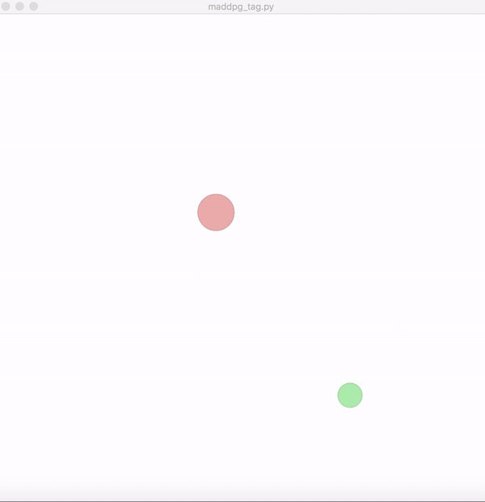
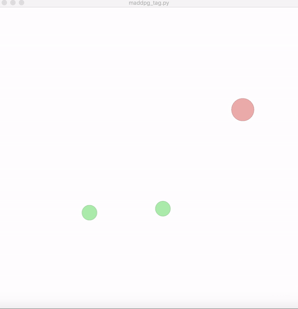

# Final Project (Multi-Agent Research Project)

## Description
Final project time! Reproduce the Deep Deterministic Policy Gradients algorithm for a multi-agent particle environment. The algorithm should learn how to get both agents to ‘tag’ each other. [Here](https://github.com/rohan-sawhney/multi-agent-rl) is the example repository, reproduce the code in pure tensorflow or pure pytorch. 


[MADDPG](https://arxiv.org/abs/1706.02275) implementation to play tag in OpenAI's [multi-agent particle environment](https://github.com/openai/multiagent-particle-envs).


MADDPG 1 vs 1 | MADDPG 1 vs 2 | MADDPG 2 vs 1
:------------:|:-------------:|:-------------:
 |  | 

## Report

My solution uses pure Tensorflow.  You can use **conda** to install the virtual environment with the **environment_move_37_week_10.yml** file.

This will install all of the required libraries.


## Example
To run this program with 3 **adversaries** use the following command:

```
python maddpg_tag.py --env simple_tag_guided_parameterized --render --adversaries 3 --collision_reward 100 --experiment_prefix test/results/maddpg_param/ --episodes=1000
```

Feel free to try different combinations.


